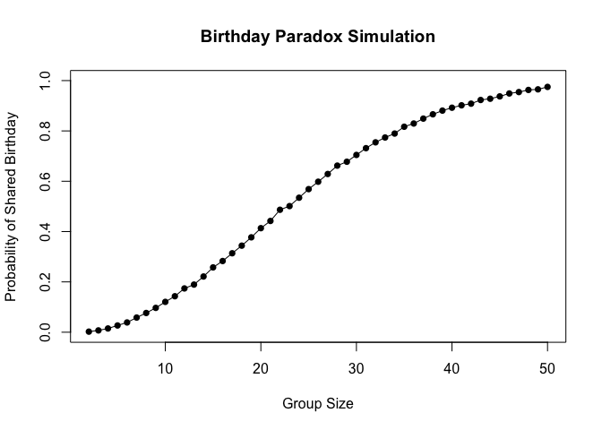
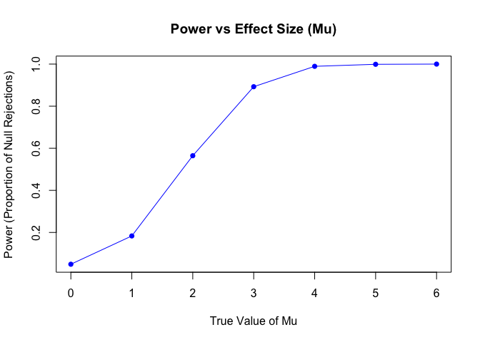
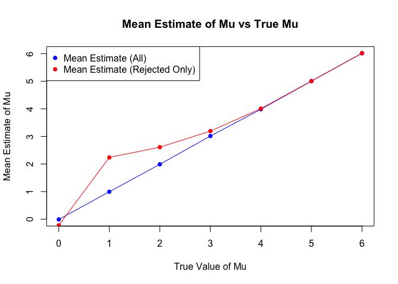
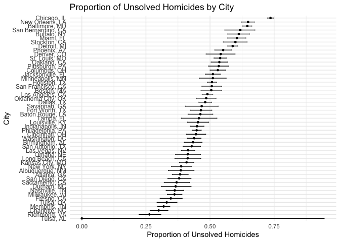

kx2224_hw5
================
Kx2224
2024-11-15

``` r
library(dplyr)
```

    ## 
    ## Attaching package: 'dplyr'

    ## The following objects are masked from 'package:stats':
    ## 
    ##     filter, lag

    ## The following objects are masked from 'package:base':
    ## 
    ##     intersect, setdiff, setequal, union

``` r
library(broom)
library(purrr)
library(tidyr)
library(ggplot2)
library(tidyverse)
```

    ## ── Attaching core tidyverse packages ──────────────────────── tidyverse 2.0.0 ──
    ## ✔ forcats   1.0.0     ✔ stringr   1.5.1
    ## ✔ lubridate 1.9.3     ✔ tibble    3.2.1
    ## ✔ readr     2.1.5

    ## ── Conflicts ────────────────────────────────────────── tidyverse_conflicts() ──
    ## ✖ dplyr::filter() masks stats::filter()
    ## ✖ dplyr::lag()    masks stats::lag()
    ## ℹ Use the conflicted package (<http://conflicted.r-lib.org/>) to force all conflicts to become errors

``` r
library(knitr)
```

## Problem 1

``` r
# build the function
has_duplicate_birthday <- function(group_size) {
  birthdays <- sample(1:365, group_size, replace = TRUE)
  return(any(duplicated(birthdays)))
}
```

``` r
# make the experiment
group_sizes <- 2:50
simulations <- 10000

# Run simulations and calculate probabilities
set.seed(42) 
probabilities <- sapply(group_sizes, function(size) {
  mean(replicate(simulations, has_duplicate_birthday(size)))
})
```

``` r
# Plot the results
plot(group_sizes, probabilities, type = "o", pch = 16, lty = 1,
     xlab = "Group Size", ylab = "Probability of Shared Birthday",
     main = "Birthday Paradox Simulation",
     ylim = c(0, 1))
```

<!-- --> As
the group size increases, the probability of at least two people sharing
a birthday increases significantly. From the result, we can find that,
with just 23 people, the probability exceeds 50%!

## Problem2

``` r
library(broom)
```

``` r
# Define parameters
n <- 30
sigma <- 5
mu_values <- c(0, 1, 2, 3, 4, 5, 6)
alpha <- 0.05
simulations <- 5000
```

``` r
power_results <- data.frame()
mean_estimates <- data.frame()

# Simulation loop over different values of mu
for (mu in mu_values) {
  rejections <- 0
  estimates <- c()
  estimates_rejected <- c()
  
  for (i in 1:simulations) {
    data <- rnorm(n, mean = mu, sd = sigma)
    
    test_result <- t.test(data, mu = 0)
    test_tidy <- tidy(test_result)
    
    estimate <- test_tidy$estimate
    p_value <- test_tidy$p.value
    
    estimates <- c(estimates, estimate)
    
    if (p_value < alpha) {
      rejections <- rejections + 1
      estimates_rejected <- c(estimates_rejected, estimate)
    }
  }
  
  power <- rejections / simulations
  power_results <- rbind(power_results, data.frame(mu = mu, power = power))
  mean_estimates <- rbind(mean_estimates, 
                          data.frame(mu = mu, mean_estimate = mean(estimates), 
                                     mean_estimate_rejected = mean(estimates_rejected, na.rm = TRUE)))
}
```

### Question1

``` r
plot(power_results$mu, power_results$power, type = "o", pch = 16, col = "blue",
     xlab = "True Value of Mu", ylab = "Power (Proportion of Null Rejections)",
     main = "Power vs Effect Size (Mu)")
```

<!-- -->
This plot shows that as the true effect size ($\mu$) increases, the
power of the test increases. This is because larger effect sizes make it
easier to detect a difference from zero, thus increasing the power.

### Question 2

``` r
plot(mean_estimates$mu, mean_estimates$mean_estimate, type = "o", pch = 16, col = "blue",
     xlab = "True Value of Mu", ylab = "Mean Estimate of Mu",
     main = "Mean Estimate of Mu vs True Mu")
points(mean_estimates$mu, mean_estimates$mean_estimate_rejected, type = "o", pch = 16, col = "red")
legend("topleft", legend = c("Mean Estimate (All)", "Mean Estimate (Rejected Only)"),
       col = c("blue", "red"), pch = 16)
```

<!-- -->

This plot shows the average estimate of mu across all simulations and
specifically for cases where the null was rejected. The average estimate
for the rejected cases is higher than for all cases, as expected, since
we only consider cases where the test found a significant effect.

## Problem 3

``` r
homicide_data = read_csv("homicide-data.csv") |>
  arrange(reported_date)
```

    ## Rows: 52179 Columns: 12
    ## ── Column specification ────────────────────────────────────────────────────────
    ## Delimiter: ","
    ## chr (9): uid, victim_last, victim_first, victim_race, victim_age, victim_sex...
    ## dbl (3): reported_date, lat, lon
    ## 
    ## ℹ Use `spec()` to retrieve the full column specification for this data.
    ## ℹ Specify the column types or set `show_col_types = FALSE` to quiet this message.

``` r
head(homicide_data)
```

    ## # A tibble: 6 × 12
    ##   uid   reported_date victim_last victim_first victim_race victim_age victim_sex
    ##   <chr>         <dbl> <chr>       <chr>        <chr>       <chr>      <chr>     
    ## 1 Bal-…      20070101 NELSON      LEON         Black       17         Male      
    ## 2 Bir-…      20070101 FORTUNE     LAVAUGHN     Black       34         Male      
    ## 3 Bir-…      20070101 ROGERS      WYTERIA      Black       20         Female    
    ## 4 Bos-…      20070101 FERNANDES   JASON        Black       14         Male      
    ## 5 Buf-…      20070101 AKIN        MARQUITA     Black       18         Female    
    ## 6 Cha-…      20070101 PEREZ       MARIA        Hispanic    46         Female    
    ## # ℹ 5 more variables: city <chr>, state <chr>, lat <dbl>, lon <dbl>,
    ## #   disposition <chr>

### Create city_state variable and Describe

``` r
homicide_data <- homicide_data %>%
  mutate(city_state = paste(city, state, sep = ", ")) %>%
  group_by(city_state) %>%
  summarize(
    total_homicides = n(),
    unsolved_homicides = sum(disposition %in% c("Closed without arrest", "Open/No arrest"))
  )
```

Description of the aggregated data: - `city_state`: Combined city and
state information (e.g., Baltimore, MD). - `total_homicides`: Total
number of homicides reported in each city. - `unsolved_homicides`:
Number of homicides that remain unsolved (disposition marked as ‘Closed
without arrest’ or ‘Open/No arrest’).

``` r
print(homicide_data)
```

    ## # A tibble: 51 × 3
    ##    city_state      total_homicides unsolved_homicides
    ##    <chr>                     <int>              <int>
    ##  1 Albuquerque, NM             378                146
    ##  2 Atlanta, GA                 973                373
    ##  3 Baltimore, MD              2827               1825
    ##  4 Baton Rouge, LA             424                196
    ##  5 Birmingham, AL              800                347
    ##  6 Boston, MA                  614                310
    ##  7 Buffalo, NY                 521                319
    ##  8 Charlotte, NC               687                206
    ##  9 Chicago, IL                5535               4073
    ## 10 Cincinnati, OH              694                309
    ## # ℹ 41 more rows

### Baltimore test

``` r
baltimore_data <- filter(homicide_data, city_state == "Baltimore, MD")
baltimore_test <- prop.test(baltimore_data$unsolved_homicides, baltimore_data$total_homicides)
baltimore_results <- broom::tidy(baltimore_test)
print(baltimore_results)
```

    ## # A tibble: 1 × 8
    ##   estimate statistic  p.value parameter conf.low conf.high method    alternative
    ##      <dbl>     <dbl>    <dbl>     <int>    <dbl>     <dbl> <chr>     <chr>      
    ## 1    0.646      239. 6.46e-54         1    0.628     0.663 1-sample… two.sided

For the city of Baltimore, MD, a hypothesis test was conducted to
estimate the proportion of unsolved homicides. The estimated proportion
of unsolved homicides is 0.646 with a 95% confidence interval ranging
from 0.628 to 0.663.

The p-value for the test is 0, indicating that there is statistically
significant evidence to suggest that the true proportion of unsolved
homicides differs from 0.

### Create CI for all cities

``` r
allcity_prop_test_results <- homicide_data %>%
  mutate(
    test_results = purrr::map2(unsolved_homicides, total_homicides, ~ prop.test(.x, .y)),
    test_tidy = purrr::map(test_results, broom::tidy)
  ) %>%
  unnest(test_tidy) %>%
  select(city_state, estimate, conf.low, conf.high)
```

    ## Warning: There was 1 warning in `mutate()`.
    ## ℹ In argument: `test_results = purrr::map2(...)`.
    ## Caused by warning in `prop.test()`:
    ## ! Chi-squared approximation may be incorrect

``` r
allcity_prop_test_results
```

    ## # A tibble: 51 × 4
    ##    city_state      estimate conf.low conf.high
    ##    <chr>              <dbl>    <dbl>     <dbl>
    ##  1 Albuquerque, NM    0.386    0.337     0.438
    ##  2 Atlanta, GA        0.383    0.353     0.415
    ##  3 Baltimore, MD      0.646    0.628     0.663
    ##  4 Baton Rouge, LA    0.462    0.414     0.511
    ##  5 Birmingham, AL     0.434    0.399     0.469
    ##  6 Boston, MA         0.505    0.465     0.545
    ##  7 Buffalo, NY        0.612    0.569     0.654
    ##  8 Charlotte, NC      0.300    0.266     0.336
    ##  9 Chicago, IL        0.736    0.724     0.747
    ## 10 Cincinnati, OH     0.445    0.408     0.483
    ## # ℹ 41 more rows

``` r
# Plotting the estimates and confidence intervals
ggplot(allcity_prop_test_results, aes(x = reorder(city_state, estimate), y = estimate)) +
  geom_point(size = 1) +
  geom_errorbar(aes(ymin = conf.low, ymax = conf.high), width = 0.2) +
  coord_flip() +
  labs(
    title = "Proportion of Unsolved Homicides by City",
    x = "City",
    y = "Proportion of Unsolved Homicides"
  ) +
  theme_minimal()+theme(axis.text.y = element_text(size = 9))
```

<!-- -->
